# Intermediate SQL - Sales Analysis

## Overview

This project started as a SQL tutorial exercise focused on analyzing sales data. After completing the initial analysis, I decided to expand the project independently by investigating a business question that emerged from the data: **Why did revenue decline in 2020 and 2023?**

I developed my own analytical approach, progressively breaking down revenue into its main drivers and investigating customer behavior, orders, time patterns, and geographic performance.

**Project structure:** The sql folder contains the queries used throughout the analysis, including supporting queries used during the exploratory phase and a helper view (00_cohort_analysis_view.sql) required by subsequent analyses.

## Dataset

The analysis is based on the **Contoso** sample sales dataset — a synthetic dataset used by Microsoft to simulate a fictional retail company's business scenarios. It was obtained via Luke Barousse's ["Intermediate SQL for Data Analytics"](https://www.lukebarousse.com/int-sql) course, and covers the period from **2015-01-01 to 2024-04-20** (the 2024 period is partial, which is why it was excluded from the year-over-year decline analysis).

Raw data files are not included in this repository due to size. The dataset can be downloaded [here (https://github.com/lukebarousse/Int_SQL_Data_Analytics_Course/releases/download/v.0.0.0/contoso_100k.sql). 
The analysis is based on a sales dataset (originally used for a SQL tutorial) covering the period from **2015-01-01 to 2024-04-20** (the 2024 period is partial, which is why it was excluded from the year-over-year decline analysis).

**Scale:**
- 199,873 sales line items
- 83,130 distinct orders (~2.4 line items per order on average)
- 49,487 distinct customers (~1.7 orders per customer on average)

**Core tables:**
- `sales` — one row per line item (orderkey, linenumber, orderdate, 
  customerkey, storekey, productkey, quantity, netprice, unitcost, 
  exchangerate, etc.)
- `customer` — customer dimension (demographics, location, geo coordinates)

**Derived views:**
- `cohort_analysis` — pre-aggregates `sales` to customer/order-date level, then uses a window function (`MIN() OVER (PARTITION BY customerkey)`) to compute each customer's `first_purchase_date` and `cohort_year`
- `customers_per_year` — monthly customer counts and revenue, used as the denominator for cohort comparisons

**Data quality notes:**
- `customerkey` and `orderdate` are nullable in the schema, so a `LEFT JOIN` was used when joining `sales` to `customer` to avoid dropping sales with no matching customer record. In practice, this dataset has **zero** rows with null `customerkey` or `orderdate` (verified), so this is a defensive choice rather than a fix for an observed issue.

## Main Business Question

**Why did revenue decline in 2020 and 2023, and what factors contributed to these declines?**

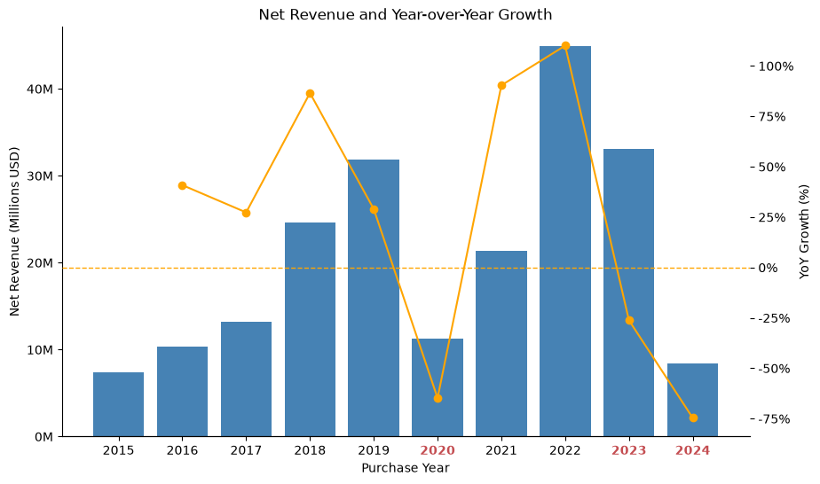
<p align="center"><em>Figure 1. Revenue Growth by Year.</em></p>

The analysis starts by examining revenue growth over time, which highlights significant declines in 2020, 2023, and 2024. Only 2020 and 2023 were selected for deeper analysis, as 2024 is considered a partial year because the available data only covers the period through April 2024.

<details>
<summary>View SQL query — customer volume by year</summary>

```sql
SELECT 
	COUNT(DISTINCT customerkey) AS total_customers,
	EXTRACT(YEAR FROM orderdate) AS purchase_year
FROM sales
GROUP BY purchase_year
ORDER BY purchase_year ASC
```

Year-over-year growth was calculated in Python (`pct_change()`) rather than 
in SQL, as the result was used directly for plotting.

</details> 


## Analysis Approach


<p align="center"><em>Figure 2. Analysis Approach.</em></p>

*In addition to this revenue decomposition, geographic performance was analyzed separately to determine whether declines were concentrated in specific markets or broad-based.*

To investigate the revenue declines, I progressively decomposed revenue into its main drivers and analyzed each component separately.

I first decomposed revenue into customer volume and revenue per customer. Since customer volume showed substantially greater variation over time, I focused the analysis on customer behavior. I then compared new and existing customers and further investigated order activity and revenue per order.

Note: this analysis is observational — it identifies which metrics moved together with the revenue decline, not a causal test of why they moved. Statistical significance and external factors are addressed as limitations below.

## Investigation Process

### 1. Identify the Main Revenue Driver: 

#### What primarily drove the revenue decline?

I first compared the two components of revenue:

- Total Customers
- Revenue per customer

| Customer Volume | Revenue per Customer |
|:---:|:---:|
| 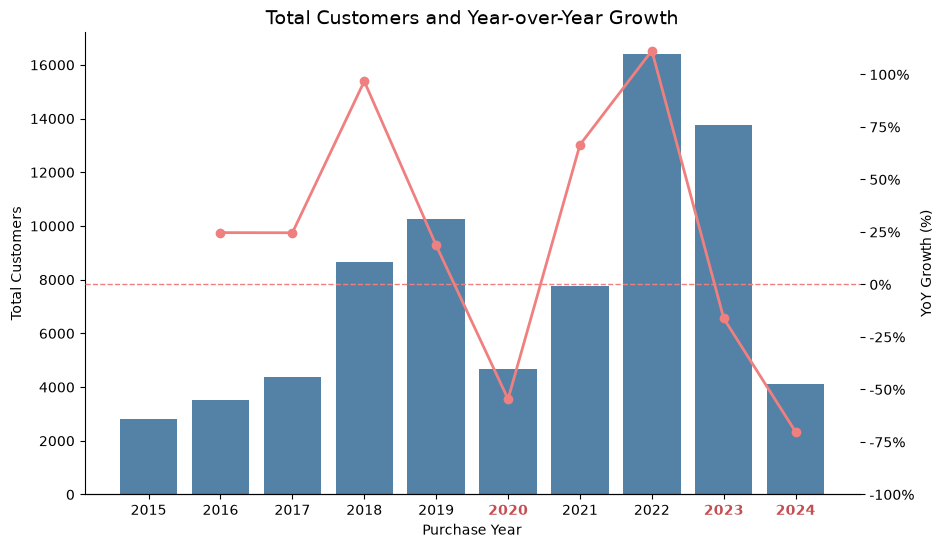 | 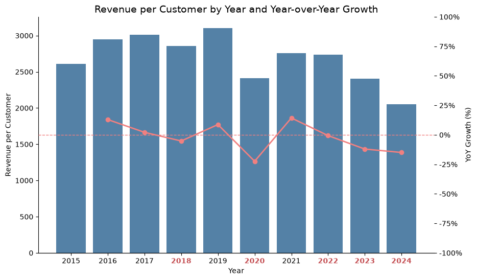 |
| *Figure 3a. Total number of customers by year and YoY growth.* | *Figure 3b. Revenue per customer by year and YoY growth.* |

Revenue per customer remained relatively stable across the years, while customer volume showed much larger fluctuations. This indicates that changes in the number of customers account for most of the variation in revenue across years, more so than changes in revenue per customer.

### 2. Analyze Customer Behavior: 

#### Was the decline in customer volume driven by customer acquisition or existing-customer activity?

Since customer volume appeared to explain most of the revenue variation, I segmented customers into two groups for a deeper analysis:

- New customers
- Existing customers

I analyzed monthly trends for both groups, with a particular focus on 2020 and 2023, to determine whether the declines were driven by weaker customer acquisition, lower activity among existing customers, or a combination of both.

<details>
<summary>View SQL query — cohort_analysis view</summary>

```sql
CREATE OR REPLACE VIEW public.cohort_analysis
AS WITH customer_revenue AS (
         SELECT s.customerkey,
            s.orderdate,
            sum(s.quantity::double precision * s.netprice * s.exchangerate) AS total_net_revenue,
            count(DISTINCT s.orderkey) AS num_orders,
            c.countryfull
           FROM sales s
             LEFT JOIN customer c ON s.customerkey = c.customerkey
          GROUP BY c.countryfull, s.customerkey, s.orderdate
        )
 SELECT customerkey,
    orderdate,
    total_net_revenue,
    num_orders,
    countryfull,
    min(orderdate) OVER (PARTITION BY customerkey) AS first_purchase_date,
    EXTRACT(year FROM min(orderdate) OVER (PARTITION BY customerkey)) AS cohort_year
   FROM customer_revenue cr;
```

Sales is pre-aggregated to customer/order-date level before applying the 
window function, reducing the number of rows the window function needs to 
process. `LEFT JOIN` is used because `customerkey` is nullable in `sales`; 
this was verified to have zero null or orphaned keys in this dataset, so the 
join is a defensive design choice rather than a fix for an observed issue.

</details>

<details>
<summary>View SQL query — new vs. existing customers</summary>

```sql
WITH customers_per_cohort AS (
    SELECT
        EXTRACT(YEAR FROM first_purchase_date) AS cohort_year,
        EXTRACT(MONTH FROM first_purchase_date) AS cohort_month,
        COUNT(DISTINCT customerkey) AS total_new_customers
    FROM cohort_analysis
    GROUP BY
        EXTRACT(YEAR FROM first_purchase_date),
        EXTRACT(MONTH FROM first_purchase_date)
)

SELECT 
    cc.cohort_year AS year,
    cc.cohort_month AS month,
    cc.total_new_customers AS new_customers,
    cy.total_customers - cc.total_new_customers AS existing_customers
FROM customers_per_cohort cc
INNER JOIN customers_per_year cy 
    ON cc.cohort_year = cy.purchase_year 
    AND cc.cohort_month = cy.purchase_month
WHERE cc.cohort_year IN (2019, 2020, 2022, 2023)
ORDER BY year, month;
```

`INNER JOIN` is used here (rather than `LEFT JOIN`) because a matching row 
in `customers_per_year` is guaranteed by construction: any customer whose 
first purchase falls in a given month necessarily made a purchase that same 
month.

</details>

<h4 align="center">New Customers</h4>

| 2019 vs 2020 | 2022 vs 2023 |
|:---:|:---:|
| 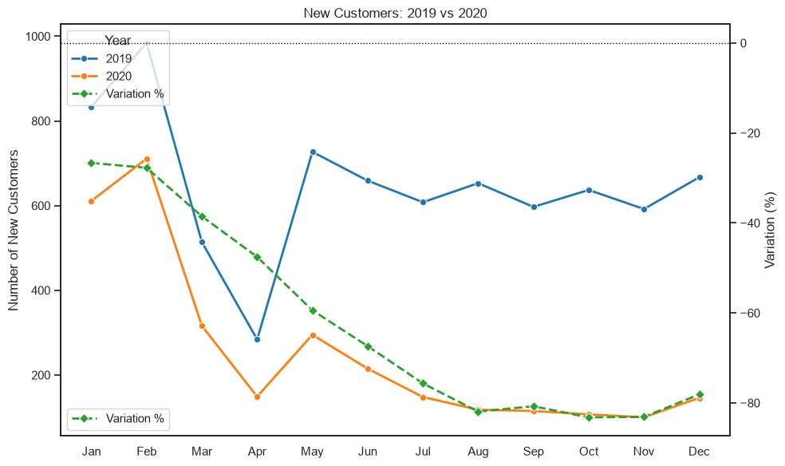 | 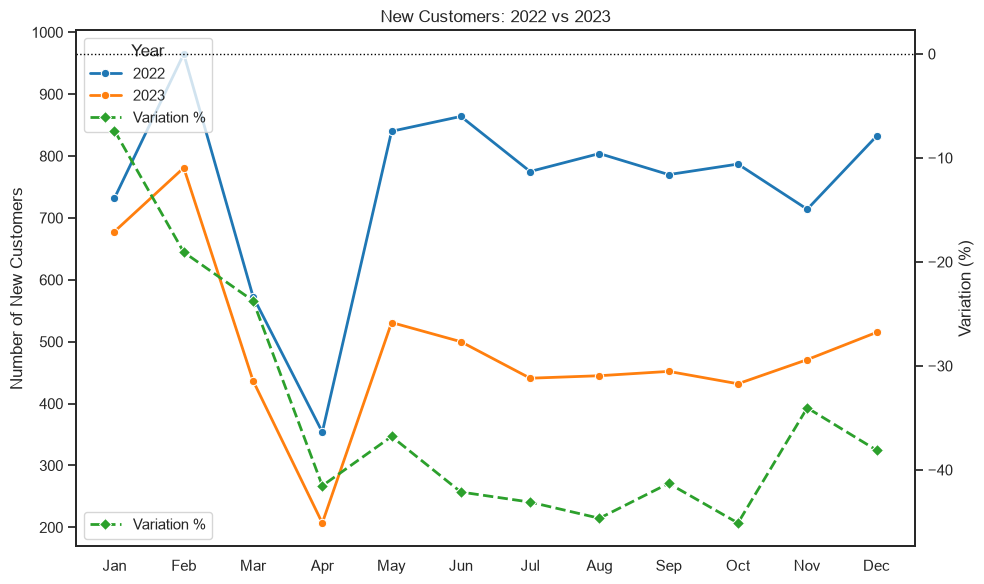 |
| *Figure 4a. New customer acquisition did not fail all at once: the year-over-year decline started at around -25% in January and worsened steadily throughout the year, reaching approximately -80% by November — an accelerating deterioration sustained almost continuously.* | *Figure 4b. New customer acquisition in 2023 was consistently weaker than in 2022 across the year, moving from around -10% in January to about -40% by year-end — a persistent but comparatively milder decline than the one observed in 2020.* |

<h4 align="center">Existing Customers</h4>

| 2019 vs 2020 | 2022 vs 2023 |
|:---:|:---:|
| 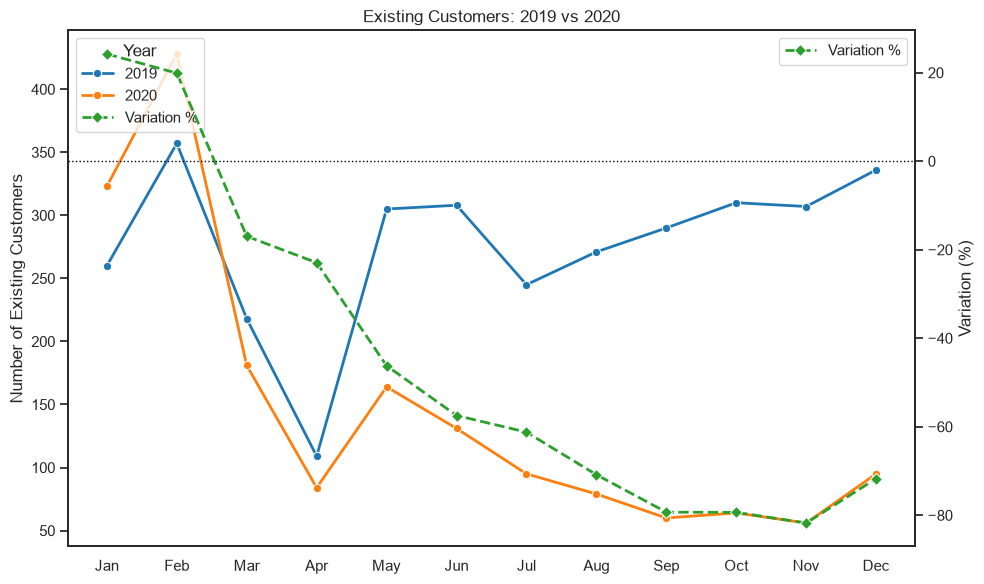 | 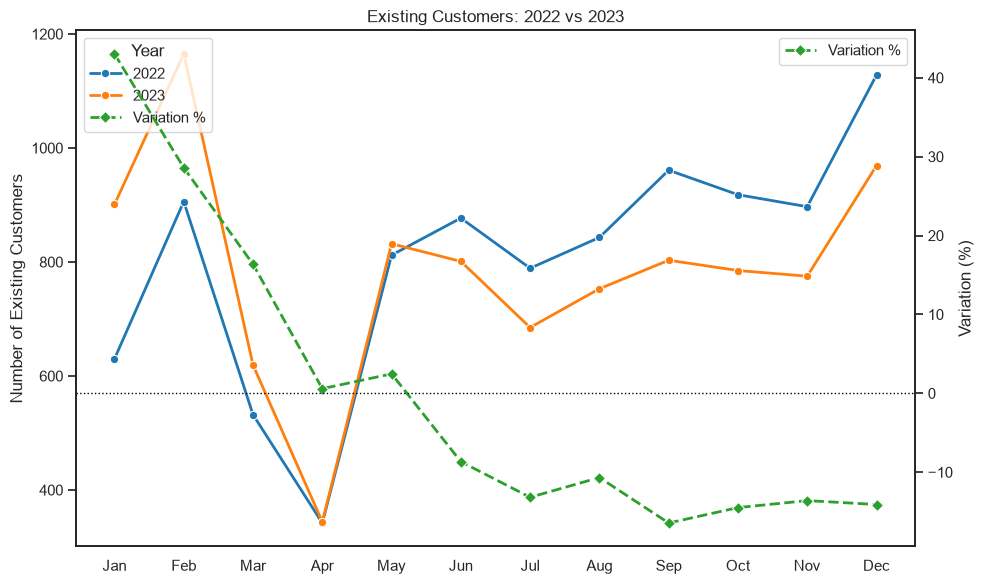 |
| *Figure 4c. Existing customer activity moved in the opposite direction over the course of the year: it started around +25% above 2019, but reversed sharply from March onward, ending the year near -80% — turning from a growth signal into one of the steepest declines observed in the entire dataset* | *Figure 4d. Existing customer activity in 2023 also reversed over the year, from roughly +40% above 2022 in early months to about -10% by year-end — a softer version of the reversal seen in existing customers during 2020, rather than a full collapse* | 


#### Key Findings

**2020:**

- **New customers** declined throughout the year compared with 2019, with a decrease of around 20% in January and up to 80% by November. This indicates a significant deterioration in customer acquisition.

- **Existing customers** showed positive variation compared with 2019 at the beginning of the year. However, from March onward, their numbers declined continuously, reaching decreases of up to 80% compared with the previous year. This indicates a substantial decline in activity among existing customers.

- The decline in new customers was the main contributor to the overall decrease in customer volume, particularly from the beginning of the year. However, the decline in existing customers from March onward further amplified the reduction in customer volume.

**2023:**

- **New customers** were consistently lower than in 2022, with monthly decreases reaching around 50%. This indicates weaker customer acquisition throughout the year.

- **Existing customers** increased compared with 2022 from January to May. However, this positive performance weakened over the following months, with existing customers declining by around 10% compared with the previous year toward the end of the year.

- New customers appear to have been the main contributor to the decline in customer volume in 2023, while the stronger performance of existing customers during the first five months partially offset the reduction.

#### Composition of the revenue

To better understand the influence of new and existing customers on revenue, I built a query that calculates the percentage contribution to revenue from each of these customer groups.

<details>
<summary>View SQL query — Customer Contribution in Revenue</summary>

```sql
WITH monthly_revenue AS (
    SELECT
        EXTRACT(YEAR FROM orderdate) AS year,
        EXTRACT(MONTH FROM orderdate) AS month,
        
        SUM(
            CASE 
                WHEN cohort_year = EXTRACT(YEAR FROM orderdate)
                THEN total_net_revenue
                ELSE 0
            END
        ) AS new_customers_revenue,
        
        SUM(
            CASE 
                WHEN cohort_year < EXTRACT(YEAR FROM orderdate)
                THEN total_net_revenue
                ELSE 0
            END
        ) AS existing_customers_revenue,
        
        SUM(total_net_revenue) AS total_revenue
        
    FROM cohort_analysis
    GROUP BY
        EXTRACT(YEAR FROM orderdate),
        EXTRACT(MONTH FROM orderdate)
)

SELECT
    year,
    month,
    new_customers_revenue,
    existing_customers_revenue,
    total_revenue,

    ROUND(
        (
            new_customers_revenue / NULLIF(total_revenue, 0) * 100
        )::numeric,
        2
    ) AS new_customers_revenue_percentage,

    ROUND(
        (
            existing_customers_revenue / NULLIF(total_revenue, 0) * 100
        )::numeric,
        2
    ) AS existing_customers_revenue_percentage

FROM monthly_revenue
ORDER BY year, month;
```
</details>  


*Figure 4e. Figure 4e. This chart helps determine the importance of the findings in the following analysis.*

#### Existing Customers Analysis

I segmented the data into cohorts based on each customer's year of first purchase. 

| 2019 | 2020 |
|:---:|:---:|
| 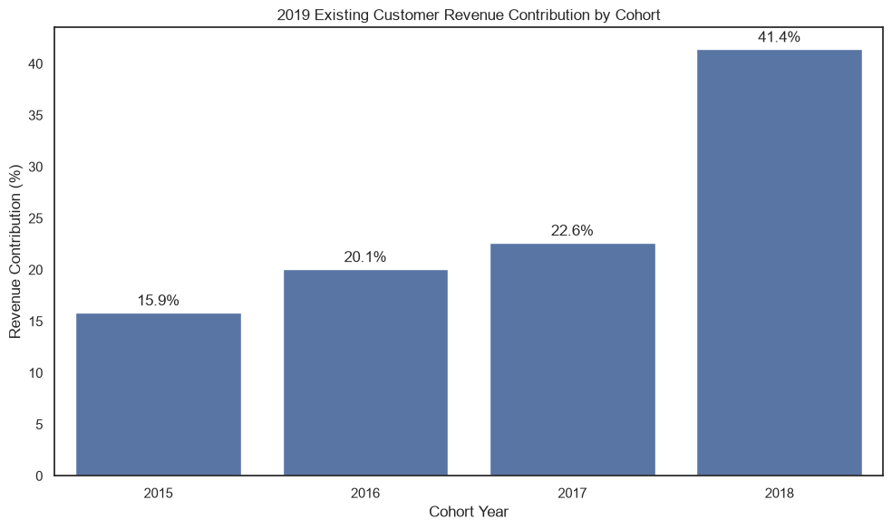 | 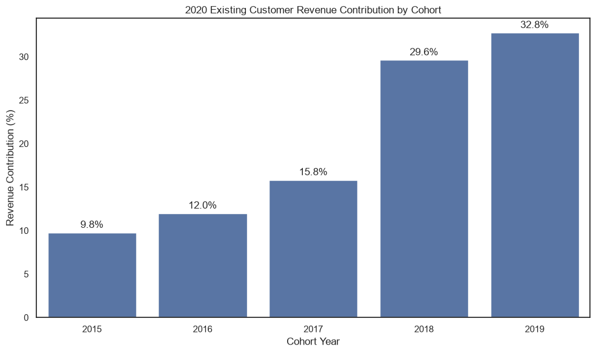 |
| 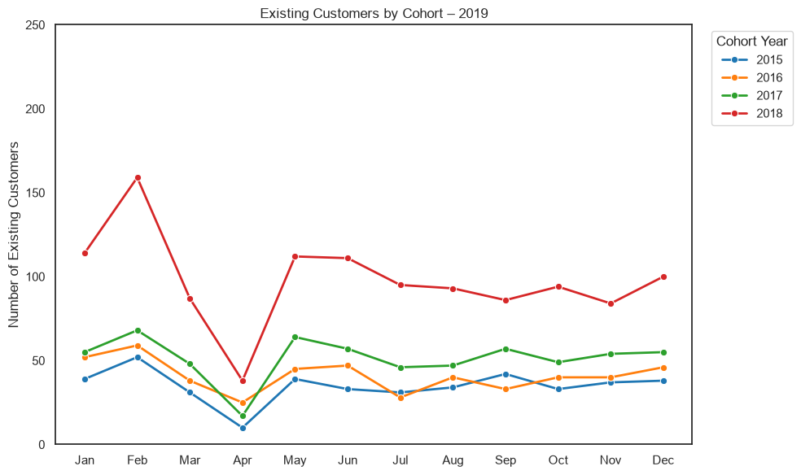 | 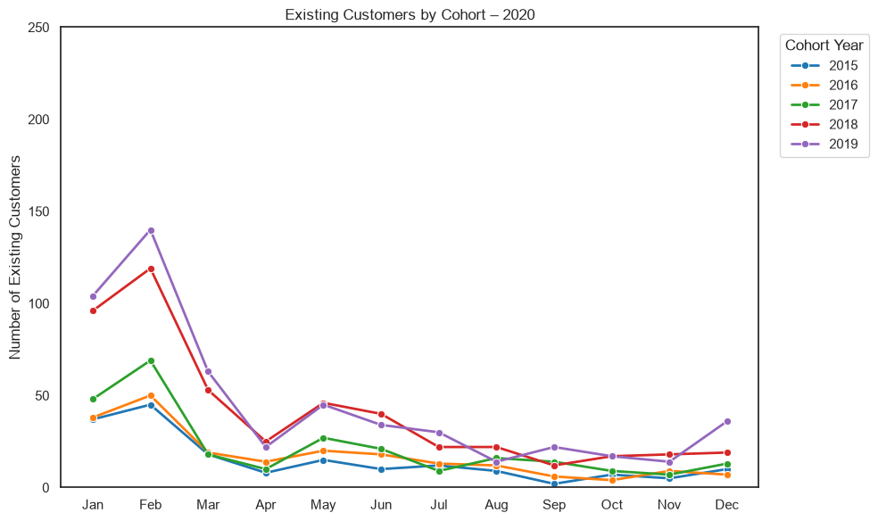 |
| *Figures 4f. Cohort's contribution to existing customer revenue and monthly variation in the number of existing customers by cohort year in 2019.* | *Figures 4g. Cohort's contribution to existing customer revenue and monthly variation in the number of existing customers by cohort year in 2020.* | 

| 2022 | 2023 |
|:---:|:---:|
| 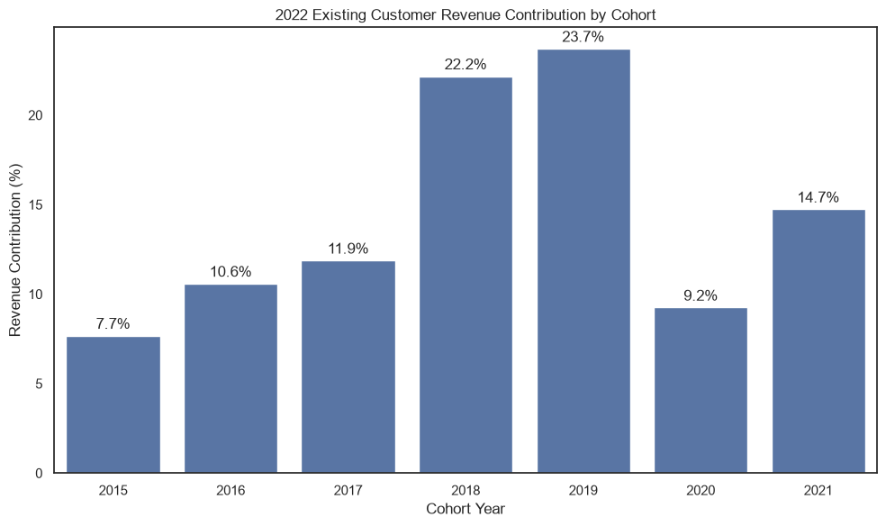 | 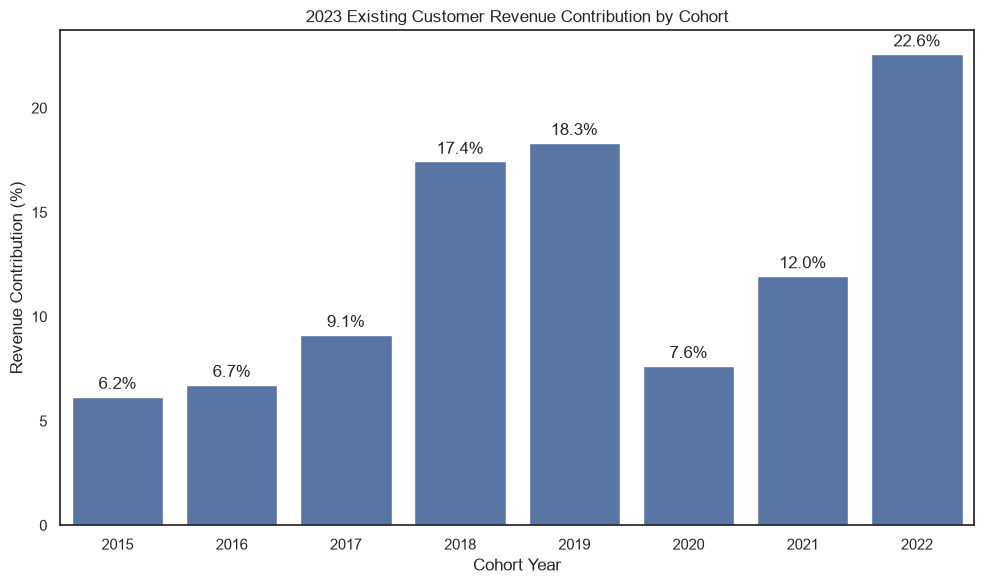 |
| 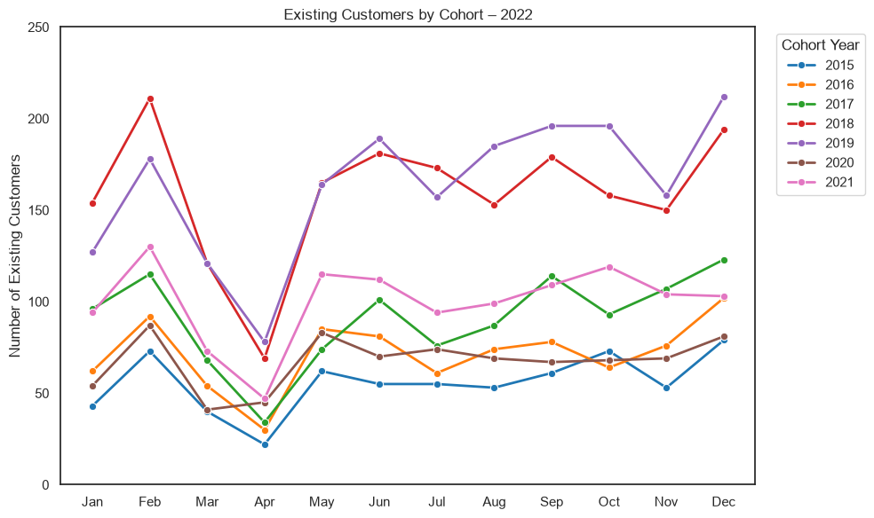 | 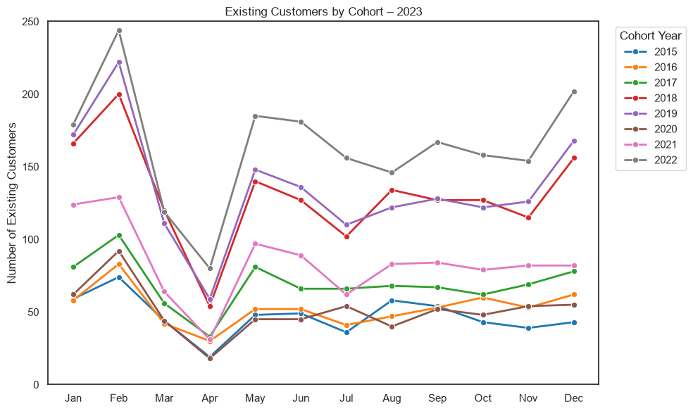 |
| *Figures 4h. Cohort's contribution to existing customer revenue and monthly variation in the number of existing customers by cohort year in 2022.* | *Figures 4i. Cohort's contribution to existing customer revenue and monthly variation in the number of existing customers by cohort year in 2023.* | 

#### Insights

**2019 and 2020**:

- The revenue composition chart shows that revenue in both 2019 and 2020 was driven primarily by new customers. This helps explain the sharp revenue decline in 2020: around 65% of revenue came from new customers, and this group declined by 80% compared with 2019.

- The existing customers' contribution to revenue increased in 2020.

- In both years, around 60% of the revenue generated by existing customers came from the two most recent cohort groups. This shows how heavily revenue depended on recently acquired customers.

- The recovery experienced by all cohort groups after the April decline in 2019 helps explain the weaker performance of existing customers in 2020, as none of the cohorts recovered after the decline in May.


**2022 and 2023**:

- The revenue composition shifted in 2023. Around 56% of revenue now came from existing customers, making the understanding of existing customer behavior even more important.

- The 2018, 2019, and 2021 cohorts (for 2022) and the 2018, 2019, and 2022 cohorts (for 2023) accounted for roughly 60% of the revenue generated by existing customers.

- Looking at the line charts, cohort groups appear to have recovered more strongly in 2022 than in 2023—especially the 2018 and 2019 cohorts. Given their large contribution to existing customer revenue, this weaker recovery likely contributed to the overall revenue decline in 2023.


### 3. Analyze Order Activity

#### Was the revenue decline also associated with fewer orders, lower order value, or both?

The previous analysis showed that changes in customer volume were a major driver of the revenue declines, particularly in 2020, while in 2023 both customer volume and revenue per customer contributed more similarly to the decline.

To further understand the underlying changes in revenue, I then analyzed order activity and revenue per order.

This provides a more detailed view of customer purchasing activity and helps determine whether the decline in revenue was associated with fewer orders, changes in the value of each order, or both.

<h4 align="center">Monthly Orders Comparison</h4>


*Figure 5a. Comparison of order volume for 2020 vs. 2019 and 2023 vs. 2022. **Blue** lines show the behavior of the years of interest, **gray** lines show the previous years, and **coral** lines show the percentage change in the year of interest compared to the previous year.*


<h4 align="center">Monthly Revenue per Order Comparison</h4>


*Figure 5b. Comparison of revenue per order for 2020 vs. 2019 and 2023 vs. 2022. **Blue** lines show the behavior of the years of interest, **gray** lines show the previous years, and **coral** lines show the percentage change in the year of interest compared to the previous year.*

#### Key Findings

**2020:** 

- Both order volume and revenue per order performed worse than in 2019, as the blue lines remain below the gray lines throughout most of the year. However, the decline was considerably larger for order volume. Revenue per order decreased by no more than approximately 40% compared with the previous year, while order volume continued to decline throughout the year, reaching a decrease of approximately 80% in November.

- This is consistent with the earlier finding for 2020: the revenue decline coincides primarily with the reduction in customer volume and, consequently, in the number of orders, rather than by a substantial decrease in the value of each order. Both metrics contributed to the overall revenue decline, but the decrease in order volume was considerably more pronounced.

**2023:** 

- A similar pattern can be observed initially, with the gray lines generally remaining above the blue lines, indicating lower performance in 2023 than in 2022. However, order volume was higher in 2023 than in 2022 during January and February.

- Order volume reached a maximum decline of approximately 20%, while also showing positive growth of approximately 20% at the beginning of the year. Revenue per order also declined compared with 2022, reaching a maximum decrease of approximately 20%, compared with around 40% in 2020, and came close to the previous year's values in August and November.

- These results suggest that the 2023 revenue decline was influenced by a combination of lower order volume and lower revenue per order, rather than being primarily driven by one of the two factors.


### 4. Analyze Geographic Performance

To determine whether the revenue declines were concentrated in specific markets or reflected a broader pattern, I compared country-level revenue before and during each decline period.

<h4 align="center">Revenue by Country</h4>

| 2019 vs. 2020 | 2022 vs. 2023 |
|:---:|:---:|
| 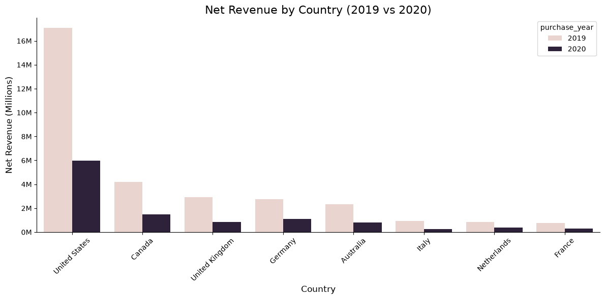 | 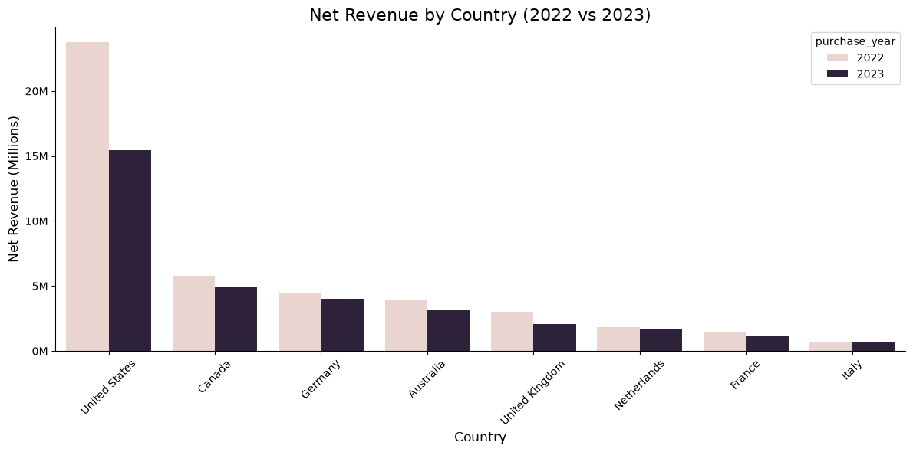 |
| *Figure 6a. Revenue by Country 2020.* | *Figure 6b. Revenue by Country 2023.* |


<h4 align="center">Revenue Change by Country</h4>

| 2019 vs. 2020 | 2022 vs. 2023 |
|:---:|:---:|
| 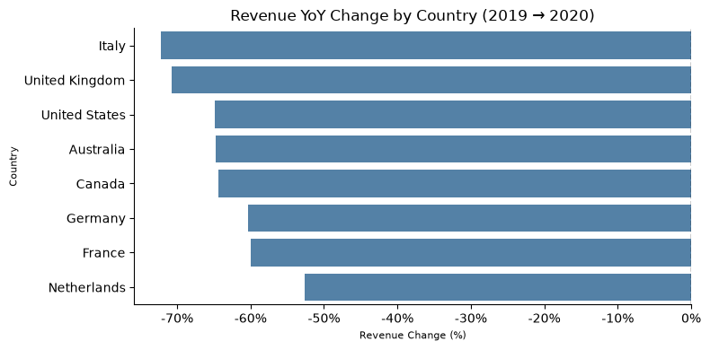 | 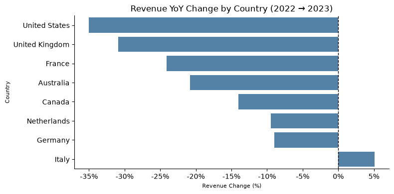 |
| *Figure 6c. Revenue Change by Country 2020.* | *Figure 6d. Revenue Change by Country 2023.* |


#### Key Findings

* From the first two charts, we can see that the revenue decline affected most of the market, as revenues in both 2020 and 2023 were lower than in the previous comparison years.

* From the second two charts, we can identify how each country contributed to the overall decline:

  * **2020:** All countries experienced a decrease in revenue. Italy and the UK were among the most affected, with declines of around **70% compared to 2019**. The remaining countries also showed significant decreases, ranging from approximately **50% to 65%**.
  * **2023:** Italy was the only country that experienced revenue growth, increasing by approximately **5% compared to 2022**. All other countries experienced declines, with the **US being the most influential**, showing a decrease of approximately **35% compared to 2022**.

* These insights show that **revenue declines across most countries contributed to the overall revenue decline in both 2020 and 2023**, although the impact varied across markets. Italy was the only exception in 2023, where revenue increased by approximately 5% compared to 2022.


## Conclusion

The analysis shows that the revenue declines observed in 2020 and 2023 were driven by different combinations of factors.

In 2020, the decline was primarily associated with a substantial reduction in customer volume. The decrease in customers was reflected in a strong decline in order volume, while revenue per order showed fluctuations but did not experience a comparable sustained decrease. The analysis of new and existing customers further showed that both groups contributed to the decline, with new customer acquisition weakening throughout the year and existing-customer activity declining significantly from March onward. Revenue composition also revealed that approximately 65% of monthly revenue came from new customers, making the business particularly vulnerable to the collapse in customer acquisition. At the same time, around 60% of existing-customer revenue came from the two most recent cohort groups, highlighting a strong dependence on recently acquired customers. Overall, the evidence indicates that the 2020 revenue decline is primarily explained by lower customer and order volume, rather than by a substantial reduction in order value.

In 2023, the decline followed a different pattern. New customer acquisition remained below the previous year's levels, while existing customers showed stronger activity during the first part of the year and partially offset the decline in new customers. Order volume also declined compared with 2022, although it recovered after the sharp drop in April. At the same time, revenue per order declined and remained below the previous year's levels, making the contribution of order volume and order value more balanced than in 2020. Revenue composition also shifted noticeably: existing customers became the primary revenue driver, contributing around 56% of monthly revenue, making cohort performance considerably more important than in 2020. The cohort analysis showed that the 2018, 2019, and 2022 cohorts accounted for roughly 60% of existing-customer revenue, while the weaker recovery of these key cohorts compared with 2022 likely contributed to the overall revenue decline. Therefore, in 2023 the decline is associated with a combination of lower customer and order volume and lower revenue per order.

The country analysis revealed an additional difference between the two years. In 2020, the revenue decline was widespread across all analyzed countries, with particularly large decreases in Italy and the UK. In 2023, the decline was more concentrated, with the US showing the largest decrease, while Italy was the only country to experience revenue growth.

Overall, the analysis identifies two distinct revenue decline scenarios. In 2020, the decline was primarily driven by a substantial loss of customers and the resulting reduction in order volume, while the revenue mix showed a heavy dependence on new customer acquisition and recently acquired cohorts. In 2023, the decline was more balanced, with both lower order volume and lower revenue per order contributing to the reduction in revenue, while existing customers became the dominant source of revenue and the performance of key cohorts played a larger role in explaining the year's results. These findings suggest that customer acquisition was the critical vulnerability in 2020, whereas customer retention and the performance of established cohorts became increasingly important in 2023.

As a next step, I would investigate the factors behind customer losses and weaker customer acquisition in 2020, as well as the reasons behind the weaker recovery of key customer cohorts and the decline in revenue per order in 2023. A more detailed analysis of customer and product behavior across countries could help identify the specific drivers behind these changes.

## Limitations

**Statistical rigor:** This analysis relies on descriptive comparisons 
(absolute values, year-over-year percentage change, and trend consistency) 
rather than formal significance testing. Given that the dataset represents 
the full population of recorded transactions rather than a sample, and that 
the declines in customer volume are large in magnitude, sustained across 
most months of the year, and break an otherwise uninterrupted multi-year 
growth trend, this is treated as strong descriptive evidence. A formal 
statistical test was not considered necessary for this exploratory analysis, 
but would strengthen the rigor of decisions made based on it.

**External context:** The 2020 decline coincides with the global COVID-19 
pandemic, a period of widespread retail disruption and reduced consumer 
discretionary spending — consistent with the broad-based decline observed 
across nearly all countries in this analysis. The 2023 decline coincides 
with a period of high inflation and rising interest rates globally, which 
typically pressures discretionary consumer spending — consistent with the 
US, one of the markets with the most aggressive rate increases that year, 
showing the largest revenue decline. However, as the exact provenance of 
this dataset (real vs. synthetic) is not confirmed, these external factors 
are presented as plausible context rather than confirmed causes.
