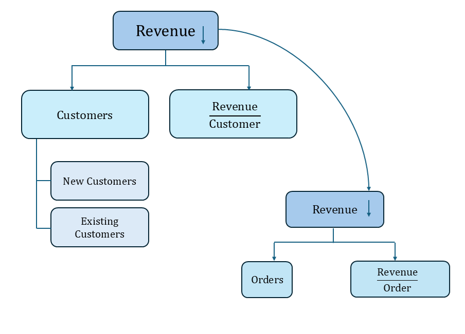
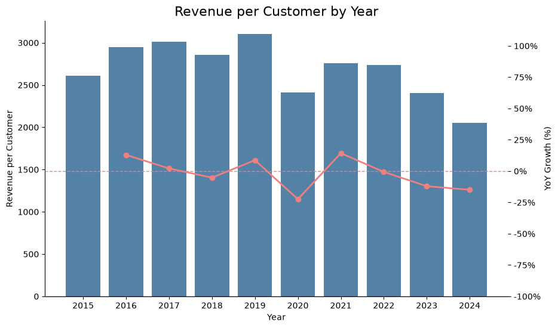
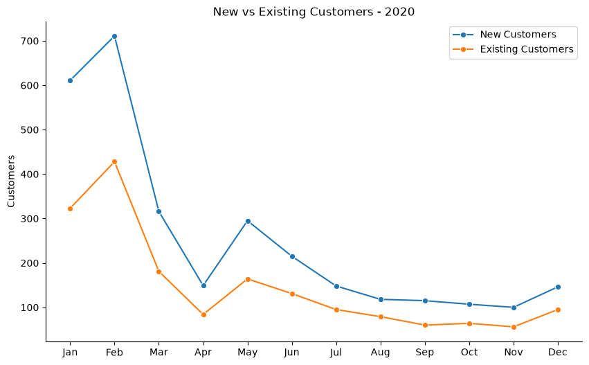
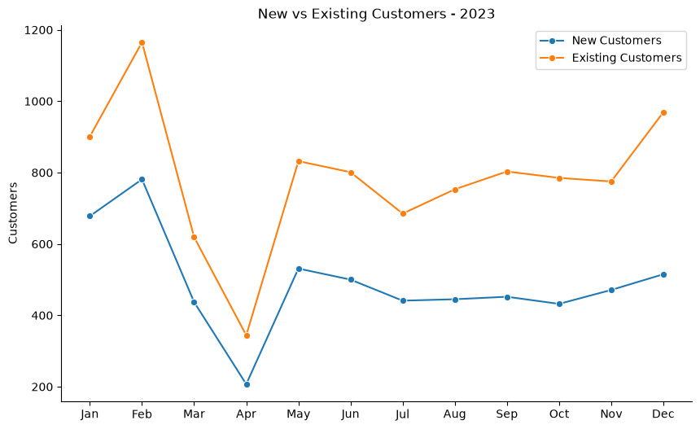

# Intermediate SQL - Sales Analysis

## Overview

This project started as a SQL tutorial exercise focused on analyzing sales data. After completing the initial analysis, I decided to expand the project independently by investigating a business question that emerged from the data: Why did revenue decline in 2020 and 2023?

I developed my own analytical approach, progressively breaking down revenue into its main drivers and investigating customer behavior, orders, time patterns, and geographic performance.

**Project structure:** The sql folder contains the queries used throughout the analysis, including supporting queries used during the exploratory phase and a helper view (00_cohort_analysis_view.sql) required by subsequent analyses.

## Main Business Question

**Why did revenue decline in 2020 and 2023, and what factors contributed to these declines?**

<em>Figure 1. Revenue Growth by Year.</em>

The analysis starts by examining revenue growth over time, which highlights significant declines in 2020, 2023, and 2024. Only 2020 and 2023 were selected for deeper analysis, as 2024 is considered a partial year because the available data only covers the period through April 2024.

## Analysis Approach

<em>Figure 2. Analysis Approach.</em>

To investigate the revenue declines, I progressively decomposed revenue into its main drivers and analyzed each component separately.

I first decomposed revenue into customer volume and revenue per customer. Since customer volume showed substantially greater variation over time, I focused the analysis on customer behavior. I then compared new and existing customers and further investigated order activity and revenue per order.

## Investigation Process

### 1. Identify the Main Revenue Driver

I first compared the two components of revenue:

- Total Customers
- Revenue per customer

| Customer Volume | Revenue per Customer |
|:---:|:---:|
|  |  |
| *Figure 3a. Total number of customers by year.* | *Figure 3b. Revenue per customer by year.* |

Revenue per customer remained relatively stable across the years, while customer volume showed much larger fluctuations. This indicated that changes in the number of customers were the primary driver of the revenue declines.

### 2. Analyze Customer Behavior

Since customer volume appeared to explain most of the revenue variation, I segmented customers into two groups:

- New customers
- Existing customers

I analyzed monthly trends for both groups, with a particular focus on 2020 and 2023, to determine whether the declines were driven by weaker customer acquisition, lower customer retention, or a combination of both.

<h4 align="center">New vs Existing Customers</h4>

| 2020 | 2023 |
|:---:|:---:|
|  |  |
| *Figure 4a. New vs Existing Customers 2020.* | *Figure 4b. New vs Existing Customers 2023.* |

#### Key Findings

- Both 2020 and 2023 show a sharp decline in customer volume during April, followed by a recovery in May.

- However, customer behavior differs after the recovery period. In 2020, both new and existing customer volumes dropped sharply after February and remained well below their pre-April levels for the rest of the year, with only a temporary rebound in May. In contrast, 2023 showed a steadier recovery, with existing customers increasing toward the end of the year, suggesting stronger customer retention.

- These results indicate that changes in customer acquisition alone do not fully explain the revenue declines. Customer retention and the purchasing behavior of existing customers may also have contributed and require further investigation.

### 3. Analyze Order Activity

To determine whether purchasing behavior reinforced the revenue declines, I compared changes in order volume and revenue per order against the previous year for both decline periods.

<h4 align="center">Monthly Orders Comparison</h4>

*Figure 5a. Comparison of order volume for 2020 vs. 2019 and 2023 vs. 2022. **Blue** lines show the behavior of the years of interest, **gray** lines show the previous years, and **coral** lines show the percentage change in the year of interest compared to the previous year.*

<h4 align="center">Monthly Revenue per Order Comparison</h4>

*Figure 5b. Comparison of revenue per order for 2020 vs. 2019 and 2023 vs. 2022. **Blue** lines show the behavior of the years of interest, **gray** lines show the previous years, and **coral** lines show the percentage change in the year of interest compared to the previous year.*

#### Key Findings

**2020:** 

- Both order volume and revenue per order performed worse than in 2019, as the blue lines remain below the gray lines throughout the year. However, the decline was considerably larger for order volume. Revenue per order decreased by no more than approximately 40% compared to the previous year, while order volume continued to decline throughout the year, reaching a decrease of approximately 80% in November.

- This supports the hypothesis identified earlier for 2020: **the revenue decline was driven primarily by the reduction in customer volume** and, consequently, in the number of orders, rather than by the value of each order. Both metrics contributed to the overall revenue decline, but the decrease in order volume was considerably more pronounced.

**2023:** 

- A similar pattern can be observed initially, with the gray lines generally remaining above the blue lines, indicating lower performance in 2023 than in 2022. However, order volume was higher in 2023 than in 2022 during January and February. The percentage changes in both order volume and revenue per order were also smaller than those observed in 2020. Order volume reached a maximum decline of approximately 20%, compared with around 80% in 2020, while also showing positive growth of approximately 20% at the beginning of the year. Revenue per order also declined compared with 2022 values, reaching a maximum decrease of approximately 20%, compared with around 40% in 2020, and came close to the previous year's values in August and November.

- These results suggest that the 2023 revenue decline was influenced by a **combination of lower order volume and lower revenue per order**, rather than being primarily driven by one of the two factors.

### 4. Analyze Geographic Performance

To determine whether the revenue declines were concentrated in specific markets or reflected a broader pattern, I compared country-level revenue before and during each decline period.

<h4 align="center">Revenue by Country</h4>

| 2019 vs. 2020 | 2022 vs. 2023 |
|:---:|:---:|
|  |  |
| *Figure 6a. Revenue by Country 2020.* | *Figure 6b. Revenue by Country 2023.* |

<h4 align="center">Revenue Change by Country</h4>

| 2019 vs. 2020 | 2022 vs. 2023 |
|:---:|:---:|
|  |  |
| *Figure 7a. Revenue Change by Country 2020.* | *Figure 7b. Revenue Change by Country 2023.* |

#### Key Findings

* From the first two charts, we can see that the revenue decline affected most of the market, as revenues in both 2020 and 2023 were lower than in the previous comparison years.

* From the second two charts, we can identify how each country contributed to the overall decline:

  * **2020:** All countries experienced a decrease in revenue. Italy and the UK were among the most affected, with declines of around **70% compared to 2019**. The remaining countries also showed significant decreases, ranging from approximately **50% to 65%**.
  * **2023:** Italy was the only country that experienced revenue growth, increasing by approximately **5% compared to 2022**. All other countries experienced declines, with the **US being the most influential**, showing a decrease of approximately **35% compared to 2022**.

* These insights show that **revenue declines across most countries contributed to the overall revenue decline in both 2020 and 2023**, although the impact varied across markets. Italy was the only exception in 2023, where revenue increased by approximately 5% compared to 2022.

## Conclusion

The analysis shows that the revenue declines observed in **2020 and 2023 were influenced by different factors**. In 2020, the decline in revenue was strongly influenced by the reduction in the number of customers and, consequently, in the number of orders, rather than by the decrease in revenue per order. In 2023, although the decrease in customers and orders was still greater than the decrease in revenue per order, the percentage variations in both metrics were much more similar, suggesting that revenue per order also contributed to the overall revenue decline.

The analysis of new and existing customers provided further insight into these declines. **In 2020, the decrease was more widespread**, and both new and existing customer volumes remained below their pre-April levels for the rest of the year. In **2023**, the number of customers recovered after the drop in April, although it did not reach the same level as at the beginning of the year. Existing customers also showed a stronger recovery toward the end of the year, suggesting better customer retention compared to 2020.

The analysis of orders supports these findings. In **2020**, the number of orders continued to decline after May, while revenue per order showed temporary fluctuations rather than a sustained decrease. This indicates that the reduction in order volume was a more significant factor in the revenue decline. In **2023**, order volume recovered after the drop in April (though not reaching 2022 values), while revenue per order tended to approach 2022 values, though not reaching them either. Since the percentage variations in both metrics were relatively similar, both order volume and revenue per order appear to have contributed to the decline.

The country analysis shows an additional difference between the two years. In **2020**, the revenue decline was widespread across all analyzed countries, with particularly large decreases in Italy and the UK. In **2023**, the decline was more concentrated, with the **US having the strongest negative impact**, while **Italy was the only country to experience revenue growth**.

Overall, the analysis highlights two different scenarios. **In 2020, the revenue decline was primarily associated with lower customer and order volume, while in 2023, both order volume and revenue per order appear to have contributed to the decline.** As a next step, I would investigate the factors behind customer losses and differences in customer behavior across markets, particularly for 2020, while further exploring the drivers behind the decline in revenue per order during 2023.
